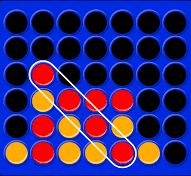

# Connect-:four:


# Table of Contents
1. [About The Project](#about-the-project)
    * [Motivation](#motivation)
    * [Methodology](#methodology)
2. [Getting Started](#getting-started)   
    * [Requirements](#requirements)
    * [Installation](#installation)  
3. [Contributors](#contributors)

## About the project
The Connect -4 game has a board which is stored as a 6x7 matrix. We toggle between players after every move. The user has to enter the column where he/she wants to place the coin. We make the move after checking if the column is within bounds and if it is not full, and then update the value of the board with the inserted coin. Next, the computer player (AI) has to find the best move among all the possible moves. 
<p>The best possible outcome for the AI as well as the worst possible outcome is predicted with the help of algorithms like <b>Mini-Max, Alpha-beta pruning</b> and <b>Negamax</b>. However this leads to excessive wastage of time if performed by only one processor and hence the use of parallelism.</p>

## Motivation

The concept of this project is to visualize how much of an impact parallelism has in the world of AI. The method proposed is by using various existing AI algorithms on adversarial games i.e games which require an opposition which in this case can be substituted with artificial intelligence. The objective is to see how fast computations can be performed through various algorithms and see how much of an improvement is achieved using parallelism. 

## Methodology

- A ***cost function value*** (states value of goodness of a position) is computed for each node in the game tree and is associated with the profitability of that game. The player will choose a move that will result in increasing the probability of his/her winning chance.
- In our connect 4 game(6x7) we have 7 branches for each node at each depth and the amount of work increases exponentially as a move is examined to a greater depth.
- We need to reduce the computation time by restricting our search to the best moves for the player. This leads us to the idea of parallelizing our game tree.
- The easiest way to parallelize the minmax algorithm is to partition the search tree into sub-trees and assign them into multiple processors for searching.
- We can divide the computation workload (evaluating the cost function of each node of the game tree) among parallel processes. If we apply a) for our game tree: In case of two parallel processors- one will evaluate the positions at 0,2,4,6 and second will evaluate at 1,3,5.
<p align="center">
  
</p>

- The ***paralleization*** takes at each of the AI algorithm and at the evaluate function.
- Inside the recursive AI function,
  ```
  #pragma omp parallel for num_threads(4) if(isMaximizingPlayer)
    if (isMaximizingPlayer)
    {
        int bestScore = INT_MIN;
        for (int i = 0; i < board.getCols(); i++)
        {
            // can we play in this column ?
            if (board.isColumnEmpty(i))
            {
                // simulate move in each column
                board.makeMove(i, player);
   ```
- Inside the EvaluateBoard function,
  ```
  int Board::evaluateBoard(int player)
  {
    int score=0;
    int i,j,c;
    vector<int> window;

    //Horizontal score calculation
    #pragma omp parallel for num_threads(3) collapse(2)
    for(i=0;i<this->ROWS;i++)
    {        
        for(j=0;j<this->COLS-3;j++)
        {
            window.push_back(board[i][j]);
            window.push_back(board[i][j+1]);
            window.push_back(board[i][j+2]);
            window.push_back(board[i][j+3]);
            score+=evaluateWindow(window,player);
            window.clear();
        }
    }
   }
   ```
- Similarly, the parallelization is done for ***vertical***, ***positive diagonal***, ***negative diagonal*** and ***center*** score calculation. 

# Getting Started
Download the ***src*** folder and copy it in your local machine.
  
## Requirements
- ***Hardware***
  * G++ Compiler
  * 32mb RAM
- ***Software***
  * Visual Studio Code Editor
  * Chrono library
  * Vector stl library
  * Iostream Library
  * OMP Library

## Installation
1. Open the ***Visual Studio Code*** editor.
2. Click `Terminal -> New Terminal`
3. Navigate to the path where you have downloaded the src folder.
4. Compile each AI algorithm.cpp 
  - `g++ GameMinimax.cpp Board.cpp -o game_minimax`
  - `g++ GameAlphaBeta.cpp Board.cpp -o game_alphabeta`
  - `g++ GameNegamax.cpp Board.cpp -o game_negamax`
5. Run the respective "***.exe***" files to observe the different computation time taken by the AI.

# Contributors
* [Sibi Akkash](https://github.com/SibiAkkash)
* [Ashwin S Guptha](https://github.com/AshwinGuptha)
* [Madhurima Magesh](https://www.linkedin.com/in/madhurima-magesh-586a561a5/)

  
